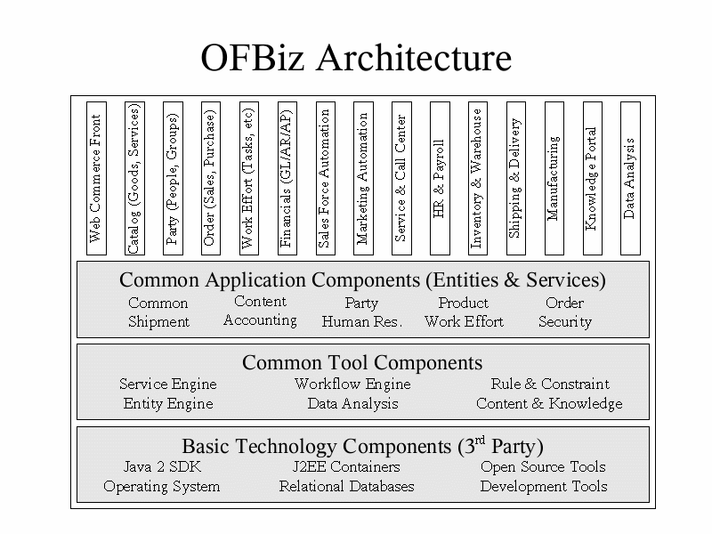
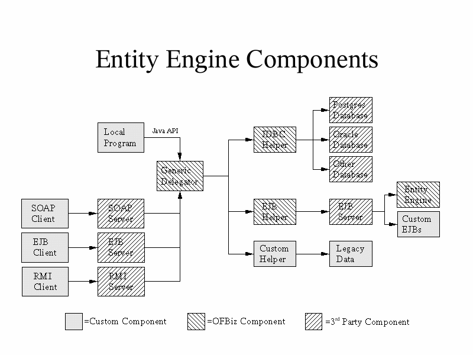
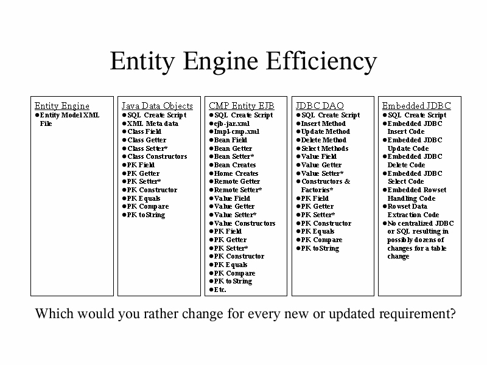
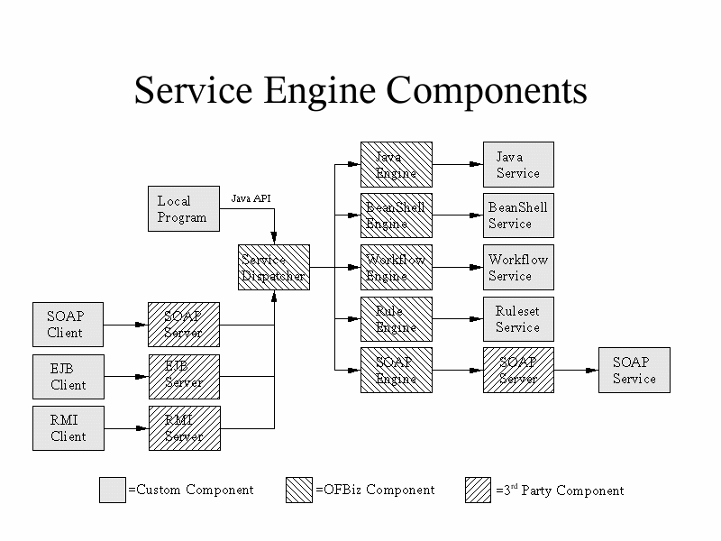

## Ofbiz是什么？ ##
OFBiz是一个非常著名的开源电子商务平台，提供了创建基于最新J2EE/XML规范和技术标准，构建大中型企业级、跨平台、跨数据库、跨应用服务器的多层、分布式电子商务类WEB应用系统的框架。 OFBiz最主要的特点是OFBiz提供了一整套的开发基于Java的web应用程序的组件和工具。包括实体引擎, 服务引擎, 消息引擎, 工作流引擎, 规则引擎等。

OFBiz 已经正式成为 Apache 的顶级项目: Apache OFBiz。

## Ofbiz愿景及架构##

- 5个‘E’
	1. Ease of Cost: 减轻成本
	2. Ease of Installation: 易于安装
	3. Ease of Customization: 方便自定义
	4. Ease of Integration: 易于集成
	5. Ease of Use: 容易使用

- 3个设计目标
	1. 使用自然语言或XML文档来定义业务逻辑、规则及数据模型。
	2. 用最少的代码来实现一个功能。
	3. 最大化地重用现有组件。

### Ofbiz架构图 ###

## OFBiz特性 ##

### 完整的J2EE框架 ###

### 通用的数据模型 ###

### 通用的业务处理API ###

### 面向服务的架构（SOA） ###
SOA 的体系架构能够易于扩展与遗留系统集成。模块化与分层的架构易于修改和增加新的功能。

OFBiz有两个基本组件：实体引擎，服务引擎。以及多个高层组件：xxx
自定义的客户端组件。

### 完善的实体引擎 ###

OFBiz的核心技术在于实体引擎Entity Engine。OFBiz实体引擎提供了一组工具和设计模式来对现实世界中特定的实体（数据对象）进行建模和管理。简言之，实体引擎的主要功能是将数据库表创建、对象与数据表的映射、对象的查询等强大的封装，这样就可以在一个简单的XML文件中定义数据库表结构，OFBiz会自动在数据库中建表，并动态生成映射对象，开发者在程序中可以只考虑对对象的处理，OFBiz会自动通过事务逻辑更新到数据库中。实体引擎的目标是简化企业级应用中对实体数据（对应关系型数据库表）的大量操作，包括定义、维护、通用操作（增、删、改、查实体和实体之间的关系）的开发工作。

对数据源透明，为跨平台服务，方便移植。
支持分布式事务。

- 提供简单的模型来使用关系数据库。
- 不用编写或维护数据实体的持久化代码。
- 实体定义在简单的XML文件中。
- 实体可以通过API来创建、存储、删除、查找、排序、缓存等。
- 支持基于JDBC驱动的任意数据库。
- 可以通过配置代理来使用多个数据源。
- 自动检查实体定义，并将差别同步到数据库中
- 在有些情况下，使用实体引擎可能不合适，你可以使用JDBC、SQLJ来绕过实体引擎。

Provides simple modeling and use of relational business data

No entity specific persistence code must be written or maintained

Entities defined in a simple XML file

With no entity specific code entities can be created, stored, removed, found, sorted, cached, etc through a single API

Supports any database with a JDBC driver

The delegator can be configured to use multiple data sources

Automatically checks databases against entity definitions creating any missing tables or columns and warning of other differences

Entity Engine can be easily bypassed with JDBC, SQLJ, etc. in the situations where the Entity Engine is not readily applicable

### 服务引擎 ###

- 多服务类型：Java，BeanShell，WorkFlow，Rules，SOAP
- 目标的触发是通过定义XML配置文件，而不是代码。
- 方法参数和返回值定义在XML里
- 服务可以通过Web来获取（SOAP Server）
- 服务可以使Web服务（SOAP Client）
- 服务可以同步调用，也可异步调用。
- 服务可以定时任务
- 服务引擎可以通过SOAP,RMI或者EJB Session Bean来触发。

Multiple service types: Java, BeanShell, Workflow, Rules, SOAP

Invocation targets defined in XML configuration, not code

Method parameters and return values defined in XML

Services can be made available as Web Services (SOAP Server)

Services can be Web Services (SOAP Client)

Services can be called synchronously or asynchronously

Services can be scheduled with iCalendar recurrence rules

A Service Engine server can be invoked remotely through SOAP, RMI, or an EJB Session Bean

### 工作流引擎 ###

Based on standards from WfMC and OMG**

Naturally models business processes and gives structure to application organization

Easy to modify or adjust by semi-technical business people

Supports manual and automatic activities

Automatic activities can use the Service Engine to easily call external services or efficiently call internal services

Process definitions and run-time data maintained in a relational database using the Entity Engine

Automatic recovery from database on a restored or replacement server (all data is in the database)

### 消息引擎 ###

Based on the BPML standard from BPMI**

Ideal for modeling business processes that involve passing messages among many parties or applications that can produce and digest the given messages

Easy to modify or adjust by semi-technical business people

Uses existing reliable messaging infrastructure (JMS, etc)

Takes advantage of existing open source tools for XML Schema, XPath and other XML related standards used in BPML

### 规则引擎 ###

Naturally models business rules as asserted facts and rules

Excellent for decision support & constraint based optimization

Easy to modify or adjust by semi-technical business people

Based on standards such as RuleML** and the Prolog logic language

Integrated with Java through custom sensors and effectors

Uses the Entity Engine to expand your knowledge base to include all the data in your database, in addition to the normal asserted facts

Forward chained rulesets can be invoked with the Service Engine

Backward chained rulesets can be treated as entities in the Entity Engine

Original implementation from Building Parsers with Java by Steven John Metsker (Addison Wesley) - has great info on logic and other engines

### 控制Servlet ###
Gives MVC style structure to web based applications

Allows JSPs to do what they do best: display information

Web application flow is maintained in an XML configuration file instead of being scattered throughout many JSPs or Servlets

Abstracts form processing from JSPs improving reuse and modularity

### 扩展性和可移植性 ###

OFBiz提供一个基于纯Java应用程序的系统框架，在具体实现中大量采用了各种设计系统模式，完全符合面向对象的设计原则中绝大部分要求，除采用J2EE核心设计模式、数据库设计模式外，在实现代码中大量引入Java设计，成为系统扩展性和可移植性的基础。
OFBiz目前兼容Weblogic，Tomcat，Jboss，Resin，Orion等厂商的应用服务器，兼容Oracle，MySQL，Sybase，PostgreSQL，Hsql等数据库产品，可以在Unix和Windows两大操作系统上进行开发和测试，具备Java应用系统的所有跨平台特点。

## 相关技术及标准 ##

OFBiz的框架中引入了当前最先进的主流开发Web应用系统构建技术，正是有这些技术的支撑，整个系统在原来的基础上不断被重构和修订，也吸引了众多对最新技术敏感的编程爱好者。

- 与OFBiz相关的开源项目有： FreeMarker 、BeanShell 、Tomcat、 Jetty 、JOTM 、XAPool 、Javolution 、JPublish、 DataVision、 JasperReports、 WEKA、 Xerces、 Xalan 、Axis、 FOP、 Batik、Ant、 BSF 、Commons 、Log4J、 Lucene 、ORO 、POI、 OpenJMS 、PostgreSQL 、MySQL、MaxDB by MySQL、 Hypersonic SQL Derby等 。

- 与OFBiz相关的技术标准有：XML 、SOAP、 HTML 、Java、J2EE、 RuleML、XPDL、BPML、UNSPSC 、ebXML 、FASB 、Workflow、GL & Party 、Product 、qbXML、 OAGIS 、UBL等 。

## OFBiz Features ##

[http://www.smedia.info/ofbiz-features.asp](http://www.smedia.info/ofbiz-features.asp)

The following is a brief overview of the major features of the The Open For Business:

Free & open source software

Standards based - Sun Java, J2EE; W3C XML, HTML, SOAP; WfMC XPDL; OMG GL, Party, Product, Workflow

All applications built on the same framework, tools & components

Standards based flexible and generic data model

Loosely coupled multi-layer component architecure

Distributed architecture

Service based logic layer

Advanced web application framework

advanced e-commerce

catalog management

promotion & pricing management

order management (sales & purchase)

customer management (part of general party management)

warehouse management

fulfillment (auto stock moves, batched pick, pack & ship)

accounting (invoice, payment & billing accounts)

manufacturing management

general work effort management (events, tasks, projects, requests, etc)

content management (for product content, web sites, general content, blogging, forums, etc)

## Technology ##

All of Apache OFBiz functionality is built on a common framework. The functionality can be divided into the following distinct layers:

### Presentation Layer ###
Apache OFBiz uses the concept of "screens" to represent the Apache OFBiz pages. Each page is, normally, represented as a screen. A page in Apache OFBiz consists of components. A component can be a header, footer, etc. When the page is rendered all the components are combined together as specified in the screen definition. Components might be Java Server Pages ([JSP]s) <deprecated>, FTL pages built around FreeMarker template engine, Forms and Menus Widgets. Widgets are an OFBiz specific technology.

### Business Layer ###
The business, or application layer defines services provided to the user. The services can be of several types: Java methods, SOAP, simple services, workflow, etc. A service engine is responsible for invocation, transactions and security. Apache OFBiz uses a set of well established, open source technologies and standards such as Java, Java EE, XML and SOAP. Although Apache OFBiz is built around the concepts used by Java EE, many of its concepts are implemented in different ways; either because Apache OFBiz was designed prior to many recent improvements in Java EE or because Apache OFBiz authors didn’t agree with those implementations.

### Data Layer ###
The data layer is responsible for database access, storage and providing a common data interface to the Business layer. Data is accessed not in Object Oriented fashion but in a relational way. Each entity (represented as a row in the database) is provided to the business layer as a set of generic values. A generic value is not typed, so fields of an entity are accessed by the column name.

----------

https://cwiki.apache.org/confluence/pages/viewpage.action?pageId=23333062#Chinese-IsOFBizforMe?-SomeQuestionsandAnswers

### 報表與分析功能 ###

OFBiz 目前有一些大約數十個預先寫好, 開箱即用的報表。還有更多報表可用 OFBiz 相關工具建立, 或使用外部報表工具(這很常見, 很多公司使用像是 Crstal Reports 或 Business Objects 與 OFbiz 應用程式一起搭配)。OFBiz 具備的工具包含在框架能建立使用者介面, 而這些相同工具同時也能建立報表。提供有效率的高階工具, 允許開發者用相同工具 ... 同樣腳本語言, 還有其他東西也都可在報表中重複使用。
OFBiz 還包括一些商業智能基本架構，能支援以星型模式來定義和表達，而後可用於專屬或預先準備的報表中。目前只一些星型模式，還在持續擴充中。

### 整合與交互操作 (SOA 架構, 提供 Web 服務) ###

OFBiz 邏輯層本身就是一個服務導向的工具, 而且 OFBiz 全部基礎邏輯都安排以服務方式實作。許多這些服務可被顯現, 自動成為 Web 服務, 還有更多複雜的也可以這麼做(或直接呼叫 Web 服務), 透過其他 Web 服務程式碼對應到。

### OFBiz 工作流程 (EDA 架構) ###

目前可在 OFBiz 內找到兩個工作流程引擎 (在 specialpurpose/ 下 workflow/ 與 shark/ 目錄)。OFBiz 本身沒使用任何一個引擎, 這些都是歷史遺跡, 最終 OFBiz 是選擇 EDA 達成想要目的。ECA (事件-條件-行動)

### Reports & analytics capabilities ###

OFBiz currently has a few dozens pre-written reports OOTB, and more can be added using the OFBiz tools, or an external reporting tool (which is still very common, ie companies that use something like Crystal Reports or Business Objects will use that with their OFBiz applications). OFBiz has tools in the framework to facilitate building of user interfaces, and these same tools are used for building reports. This provides a high level of efficiency, and allows developers to use the same tools they are used to... and in some cases scripts and other things can even be reused in reports.
OFBiz also includes some BI infrastructure to support defining and populating star schemas, which can then be used for ad-hoc or pre-written reports. A limited star schema exists, and work is going on to extend it.

### Integration and Interoperability (SOA Architecture, Web Services offered) ###

The OFBiz logic layer is itself a Service-Oriented tool, and all primary logic in OFBiz is implemented as services. Many of these services can be exposed externally as web services automatically, and the more complex ones can be exposed as web services (or call web services) through web services code that maps to them.

### OFBiz Workflow (EDA Architecture) ###

Though you may find two Workflow Engines in OFBiz (in older releases in specialpurpose : workflow and shark directories) OFBIz itself does not use a Workflow Engine. It has been tried, but OFBiz is finally using EDA through its concept of ECA (Event Condition Action)

----------

## 选择Ofbiz有什么好处？ ##

Ofbiz的具体功能优势可以从几大方面来体会。

1. 开源，OFBiz目前得到Apache License（Version 2.0）——开源软件最灵活的许可证之一。该许可证授予您自由使用任何期望的技术、构建派生的作品进行发行、然后将代码贡献回社区[5]。详细证书内容可以查看http://www.apache.org/licenses/LICENSE-2.0。与其他许可证相比，Apache License的自由在于它强调使用源代码的人不需要公开自己的源代码（修改后的源代码），在这种情况下，不管是编程爱好者还是商业公司，从免费获取OFBiz的源代码开始，就可以自由地定制自己所想要的OFBiz，而这并不需要向任何一家公司支付所谓的专利费用。
2. 功能强大，已经拥有了已经开发好，并且稳定的常用业务。
3. 功能扩展方案。Ofbiz提供了一套基于JAVA的功能扩展方案，可以在目前最基本的功能上添加新的功能。并且基于Component组件开发，对于不需要的功能可以将相应Component去除掉。
4. 面向企业应用而设计，Ofbiz不是纯技术框架，是面向业务的（SOA）
5. 用很少的 Code 完成复杂的处理。Ofbiz自身实现了MVC框架、ORM。通过 XML 对系统进行建模，以 XML 来定义系统中不同的层次关系，尽量减少写 Java 代码的数量
6. 缩短开发企业级WEB应用系统的进度和成本
7. OFBiz从技术架构上来说是SOA (Service Oriented Architecture)
8. OFBiz和其他架构最大的不同在于它不仅仅是一个优秀的技术架构，还是一个优秀的业务架构.在应用软件开发领域，单纯的技术框架是没有多少价值的，因为IT行业已经过了泡沫时期，现在要赚钱，是那些面向行业的的业务框架。不过业务框架相对于技术框架来说，更加难以成功，因为技术框架解决的问题相对明确和简单，而业务框架要解决的商务问题实在太灵活多变了，也许Ofbiz算是一个成功的业务框架，如果你能够做出一个很好的某行业的业务框架，赚钱是一定的了。 

为什么不使用SSH

1. Ofbiz是业务框架，SSH属于技术框架，并非一个层次。
2. 就好比你可以买下零件自己组装汽车，但是 Oracle 是组装整车的公司，某一部分不一定是最好的，但是它们组合在一起是最有效率的，每一部分都可以很好地发挥作用。 现在的 Open Source 世界所提供的就是这样的一些汽车零件。把这些零件拼装起来就可以生产整车了，但是你不能简单地拼凑起来，那样是跑不过别人的车的，从 DIY 到提供真正的商业价值的道路还是很远的。

## 类似框架 ##
解决业务问题的业务框架有很多，IBM 兜售的解决方案中就有面向业务的框架，比如以前的[NetSuite E-Commerce](http://www.netsuite.com/portal/home.shtml)。开源的业务框架只用过Ofbiz。

## 有哪些成功案例？ ##

- [百货购](http://www.100hg.com/)
- [美陶家](http://www.meitaojia.com/)
- [gorun8](http://www.gorun8.cn/dyn/main)

## 参考资料 ##

http://blog.sina.com.cn/s/blog_976e49570100ycwe.html

http://www.360doc.com/content/07/0529/16/11586_527277.shtml

http://www.blogjava.net/wealupa/archive/2007/04/19/111971.html

http://dagmom.iteye.com/blog/1625642

http://wang-guo-qiang.iteye.com/blog/106090/

http://wang-guo-qiang.iteye.com/blog/106088

http://wenku.baidu.com/view/792757a0f524ccbff1218440.html

http://www.iteye.com/topic/1032

# 文档修改 #

1. 貌似不是给开发人员看的，这个文档将来会打包成产品的一部分，所以要尽量吹一吹他的技术优势，比如使用xml，展开描述下，使用实体引擎，服务引擎展开说明，值到别人看不懂为止。