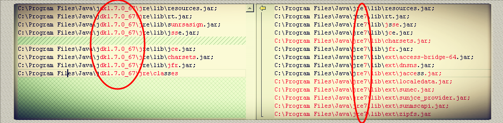

title: Eclipse下启动Ofbiz后，Https访问不了
date: 2014-12-02 00:00:00 
category: 教程技术
tags: 涨技能
description: 方便自己

---

# Eclipse下启动Ofbiz后，Https访问不了 #

## 问题复现 ##
1. 找到Start类，运行main方法。
2. 访问http没问题，点击登陆跳转到https，打不开，没有任何错误提示。

## 问题描述 ##
1. 通过ant启动，可以访问https
2. 直接命令行java -jar ofbiz.jar 也可以访问https

## 问题原因 ##
前后对比，唯一原因就是两次运行的java环境可能不一致。

通过ant或者命令行方式启动，都是用的系统环境变量里的jdk\bin下的java启动，而eclipse用的是jre下的java

## 解决过程 ##
1. 通过netstat -ano|findstr 8443 确认端口是否开启，确定已开启。
2. 通过telnet localhost 8443 看看是否可以连接，确定可以连接
3. 开始蒙圈了
4. jconsole查看可以访问https的启动参数和不可以访问时有什么不同。
5. 找到不同的地方
6. 修改eclipse的JRE配置（我的是已经改成了JDK，但是未点击restore default，导致还是jre的配置）
7. 再次启动，https可以访问。

